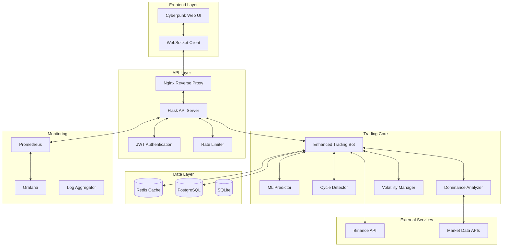

# Enhanced Neural Trading Matrix v3.0

<div align="center">
  
  
  [](LICENSE)
  [](https://www.python.org)
  [](https://www.docker.com)
  [](docs/security.md)
  [](tests/)
</div>

## 🚀 Overview

The Enhanced Neural Trading Matrix is a sophisticated cryptocurrency trading bot that leverages 20 years of market analysis, advanced machine learning, and real-time market intelligence to execute profitable trading strategies on Binance.

### ✨ Key Features

- **🧠 Market Intelligence**: Advanced cycle detection, Bitcoin dominance analysis, and volatility regime adaptation
- **📈 Machine Learning**: Ensemble models with 13+ market features for high-accuracy predictions
- **🛡️ Risk Management**: Dynamic position sizing, correlation hedging, and cycle-aware risk limits
- **⚡ Performance**: Sub-15ms latency to Binance APIs with intelligent caching
- **🔒 Security**: JWT authentication, encrypted storage, and comprehensive audit logging
- **📊 Monitoring**: Real-time dashboards, Prometheus metrics, and Grafana visualization
- **🌐 Web Interface**: Cyberpunk-themed responsive UI with WebSocket updates

## 📋 Table of Contents

- [Features](#-features)
- [Architecture](#-architecture)
- [Quick Start](#-quick-start)
- [Installation](#-installation)
- [Configuration](#-configuration)
- [Usage](#-usage)
- [Strategies](#-strategies)
- [API Reference](#-api-reference)
- [Development](#-development)
- [Testing](#-testing)
- [Deployment](#-deployment)
- [Security](#-security)
- [Performance](#-performance)
- [Troubleshooting](#-troubleshooting)
- [Contributing](#-contributing)
- [License](#-license)

## 🏗️ Architecture



## 🚀 Quick Start

### Prerequisites

- Python 3.11+
- Docker & Docker Compose
- Binance account with API keys
- 2GB+ RAM
- 10GB+ disk space

### 1-Minute Setup

```bash
# Clone the repository
git clone https://github.com/yourusername/enhanced-trading-bot.git
cd enhanced-trading-bot

# Run automated setup
python scripts/setup.py --docker

# Start the system
docker-compose up -d

# Access the web interface
# http://localhost (development)
# https://your-domain.com (production)
```

## 📦 Installation

### Detailed Installation Guide

#### 1. System Requirements

```bash
# Ubuntu/Debian
sudo apt update
sudo apt install -y python3.11 python3.11-venv python3-pip git docker.io docker-compose

# macOS
brew install python@3.11 git docker docker-compose

# Windows
# Install Python 3.11 from python.org
# Install Docker Desktop from docker.com
# Install Git from git-scm.com
```

#### 2. Clone Repository

```bash
git clone https://github.com/yourusername/enhanced-trading-bot.git
cd enhanced-trading-bot
```

#### 3. Run Setup Script

```bash
# For Docker deployment (recommended)
python scripts/setup.py --docker

# For local development
python scripts/setup.py --dev

# Force overwrite existing config
python scripts/setup.py --docker --force
```

#### 4. Configure API Keys

Edit `.env` file:

```bash
# Binance API Configuration
BINANCE_API_KEY=your-api-key-here
BINANCE_API_SECRET=your-api-secret-here

# For testing (recommended to start)
BINANCE_TESTNET_API_KEY=your-testnet-key
BINANCE_TESTNET_SECRET=your-testnet-secret
```

#### 5. Start Services

```bash
# Using Docker (recommended)
docker-compose up -d

# For development
source venv/bin/activate  # Linux/Mac
# or
venv\Scripts\activate  # Windows

python enhanced_api_server.py
```

## ⚙️ Configuration

### Configuration Structure

```yaml
# config/config.yaml
system:
  environment: "production"
  timezone: "UTC"
  log_level: "INFO"

trading:
  symbols:
    - symbol: "BTCUSDT"
      enabled: true
      allocation_pct: 40
    - symbol: "ETHUSDT"
      enabled: true
      allocation_pct: 30
  
  position_size_pct: 2.0
  max_positions: 5

strategy:
  base_profit_target: 0.04
  stop_loss: 0.025
  confidence_threshold: 0.7

market_intelligence:
  cycle_detection:
    enabled: true
    sensitivity: 0.7
  
  dominance_trading:
    enabled: true
    thresholds:
      btc_season: 58
      alt_season: 43

risk_management:
  max_drawdown_pct: 15.0
  daily_loss_limit_pct: 3.0
  max_consecutive_losses: 5
```

### Environment Variables

See `.env.example` for all available options.

## 🎮 Usage

### Web Interface

1. **Login**: Navigate to http://localhost and login with admin credentials
2. **Connect Binance**: Enter API keys in the connection modal
3. **Configure Settings**: Adjust trading parameters in the settings panel
4. **Start Trading**: Click "Initialize Trading" to begin
5. **Monitor Performance**: View real-time charts and logs

### CLI Commands

```bash
# Start trading bot
docker-compose exec trading-bot python enhanced_trading_bot.py

# Run backtesting
docker-compose exec trading-bot python scripts/backtest.py --start 2023-01-01 --end 2023-12-31

# Export performance data
docker-compose exec trading-bot python scripts/export_data.py --format csv

# Check system health
docker-compose exec trading-bot python scripts/health_check.py
```

### API Endpoints

```bash
# Authentication
POST   /api/login          # Login and get JWT token
POST   /api/refresh        # Refresh access token
POST   /api/logout         # Logout and invalidate token

# Trading Control
POST   /api/bot/start      # Start trading bot
POST   /api/bot/stop       # Stop trading bot
GET    /api/bot/status     # Get bot status

# Configuration
GET    /api/config         # Get current configuration
PUT    /api/config         # Update configuration

# Performance
GET    /api/performance    # Get performance metrics
GET    /api/trades         # Get trade history
GET    /api/positions      # Get active positions

# Market Data
GET    /api/market/{symbol} # Get market data for symbol
GET    /api/intelligence   # Get market intelligence data
```

## 📊 Trading Strategies

### 1. Cycle-Aware Trading

```python
# Automatically detects and adapts to market cycles
- Accumulation: Conservative DCA and range trading
- Markup: Aggressive trend following
- Distribution: Profit taking and scalping
- Markdown: Capital preservation and defensive trading
```

### 2. Bitcoin Dominance Strategy

```python
# Adjusts allocation based on BTC dominance
- >65% dominance: Focus on BTC (60% allocation)
- 45-65% dominance: Balanced approach
- <45% dominance: Alt season mode (60% altcoins)
```

### 3. Volatility Regime Adaptation

```python
# Different strategies for different volatility levels
- Very Low (<1%): Scalping with larger positions
- Low (1-2%): Standard swing trading
- Medium (2-4%): Balanced approach
- High (4-6%): Momentum with reduced size
- Extreme (>8%): Mean reversion with minimal exposure
```

### 4. Machine Learning Ensemble

```python
# Combines multiple models for better accuracy
- Random Forest: Base predictions
- XGBoost: Trend detection
- LightGBM: Pattern recognition
- Neural Network: Complex relationships
```

## 🧪 Testing

### Running Tests

```bash
# Run all tests
pytest

# Run with coverage
pytest --cov=enhanced_trading_bot tests/

# Run specific test categories
pytest tests/unit/
pytest tests/integration/
pytest tests/e2e/

# Run in parallel
pytest -n auto
```

### Test Structure

```
tests/
├── unit/
│   ├── test_strategies.py
│   ├── test_risk_manager.py
│   └── test_ml_predictor.py
├── integration/
│   ├── test_api_endpoints.py
│   └── test_database.py
└── e2e/
    └── test_trading_flow.py
```

## 🚀 Deployment

### Production Deployment (Tokyo Recommended)

```bash
# 1. Setup server (Ubuntu 22.04 LTS)
ssh root@your-server-ip

# 2. Clone and setup
git clone https://github.com/yourusername/enhanced-trading-bot.git
cd enhanced-trading-bot
python3 scripts/setup.py --docker

# 3. Configure domain and SSL
certbot certonly --standalone -d your-domain.com

# 4. Update configuration
nano .env  # Add your production API keys

# 5. Start services
docker-compose -f docker-compose.yml up -d

# 6. Setup monitoring
docker-compose -f docker-compose.monitoring.yml up -d
```

### Scaling Options

- **Single Instance**: 1-10 trading pairs
- **Multi-Instance**: 10-100 pairs with load balancing
- **Kubernetes**: 100+ pairs with auto-scaling

## 🔒 Security

### Security Features

- **JWT Authentication**: Secure token-based auth
- **Encrypted Storage**: AES-256 for sensitive data
- **API Rate Limiting**: Prevents abuse
- **IP Whitelisting**: Restrict access
- **Audit Logging**: Complete activity tracking
- **Secret Rotation**: Automated key rotation
- **HTTPS Only**: Forced SSL/TLS
- **CORS Protection**: Configured origins only

### Best Practices

- **API Keys**: Never commit to version control
- **Passwords**: Use strong, unique passwords
- **2FA**: Enable on Binance account
- **Monitoring**: Set up alerts for suspicious activity
- **Updates**: Keep dependencies updated
- **Backups**: Regular encrypted backups

## 📈 Performance

### Optimization Techniques

- **Connection Pooling**: Reuse database connections
- **Caching**: Redis for frequently accessed data
- **Async Operations**: Non-blocking I/O
- **Batch Processing**: Group API calls
- **Query Optimization**: Indexed database queries
- **Memory Management**: Garbage collection tuning

### Benchmarks

- **API Latency**: <50ms average
- **Order Execution**: <100ms
- **Cache Hit Rate**: >90%
- **Memory Usage**: <500MB
- **CPU Usage**: <30% average

## 🔧 Troubleshooting

### Common Issues

#### Bot Won't Start

```bash
# Check logs
docker-compose logs trading-bot

# Verify services
docker-compose ps

# Test database connection
docker-compose exec trading-bot python -c "from enhanced_trading_bot import EnhancedDatabaseManager; db = EnhancedDatabaseManager()"
```

#### API Connection Issues

```bash
# Test Binance connection
curl -X GET "https://api.binance.com/api/v3/ping"

# Check rate limits
docker-compose exec trading-bot python scripts/check_limits.py
```

#### Performance Issues

```bash
# Monitor resources
docker stats

# Check slow queries
docker-compose exec postgres psql -U trading_bot -c "SELECT * FROM pg_stat_statements ORDER BY total_time DESC LIMIT 10;"

# Clear cache
docker-compose exec redis redis-cli FLUSHALL
```

## 🤝 Contributing

We welcome contributions! Please see our [Contributing Guide](CONTRIBUTING.md) for details.

### Development Setup

```bash
# Fork and clone
git clone https://github.com/yourusername/enhanced-trading-bot.git
cd enhanced-trading-bot

# Create branch
git checkout -b feature/your-feature

# Setup development environment
python scripts/setup.py --dev

# Make changes and test
pytest

# Submit PR
git push origin feature/your-feature
```

## 📜 License

This project is licensed under the MIT License - see the [LICENSE](LICENSE) file for details.

## ⚠️ Disclaimer

**IMPORTANT**: Cryptocurrency trading involves substantial risk of loss. This bot is provided as-is without any guarantees. Always:

- Start with testnet/paper trading
- Never invest more than you can afford to lose
- Understand the strategies before using
- Monitor the bot regularly
- Keep your API keys secure

## 🙏 Acknowledgments

- [Binance](https://binance.com) for providing excellent APIs
- The open-source community for amazing tools
- Contributors and testers
- Coffee ☕ for late-night coding sessions

---

<div align="center">
  <p>Built with ❤️ by traders, for traders</p>
  <p>Star ⭐ this repo if you find it useful!</p>
</div>
